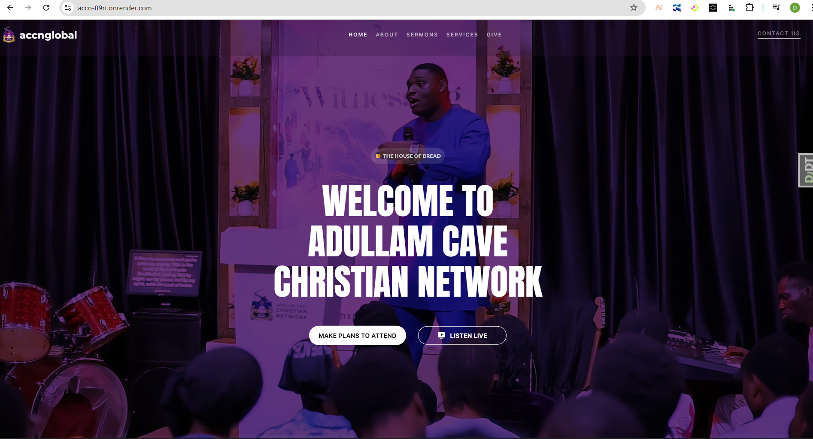
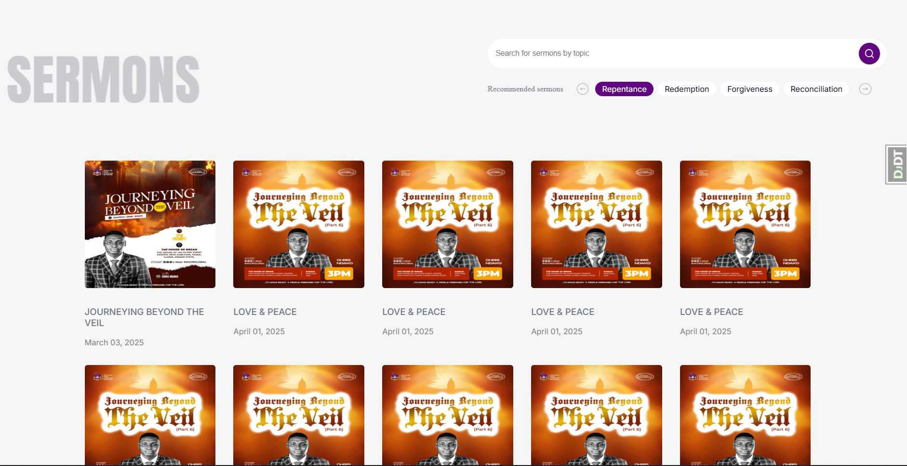

# 👨‍💻 Fullstack Developer Portfolio

Hi, I'm Deborah Olaboye, a passionate fullstack developer experienced in building dynamic and scalable web applications using Django, React, and modern technologies.

---

## 🛠️ Tech Stack

---

## 📁 Projects

### TechHub

**Tech:** Django, HTML/CSS, Javascript
A dynamic Django-based website enabling customers to request quotations and browse available services. Built backend functionalities, including request submission forms, database integration, and service catalog management. Deployed the application on Render for secure and reliable hosting.

### ACCN

**Tech:** Django, HTML/CSS, Javascript  
A fullstack web app that allows users to register and admins seamlessly manage users. The platform integrates form validations, secure authentication, and responsive UI.

---

## 📷 Screenshots

---

### Smart Task Manager – Task API System

**Tech:** Django REST Framework  
CRUD API with user-based permissions, superuser controls, and simple frontend interface in `task_list.html`.

## 📫 Let's Connect

- GitHub: [https://github.com/DeborahOlaboye]
- LinkedIn: [https://www.linkedin.com/in/olaboye-deborah-575094156/]
- Twitter: [https://x.com/theglobaldebby]
- Email: [deboraholaboye@gmail.com]
